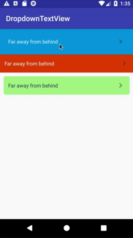

# DropdownTextView
Simple drop-down TextView for Android

## Intro




## Usage

Adds drop-down to your layout via XML

```xml
<LinearLayout
    xmlns:android="http://schemas.android.com/apk/res/android"
    xmlns:app="http://schemas.android.com/apk/res-auto"
    android:layout_width="match_parent"
    android:layout_height="match_parent"
    android:orientation="vertical">


    <hakobastvatsatryan.DropdownTextView
        android:id="@+id/first_dropdown_text_view"
        android:layout_width="match_parent"
        android:layout_height="wrap_content"
        app:title_font="@font/your-title-font"
        app:title_text="@string/your-title-text"
        app:title_text_color="@color/your-title-text-color"
        app:title_text_color_expanded="@color/your-title-text-color-expanded"
        app:title_text_size="@dimen/your-title-text-size"
        app:content_font="@font/your-font"
        app:content_padding="@dimen/your-content-padding"
        app:content_text="@string/your-content-text"
        app:content_text_color="@color/your-content-text-color"
        app:content_text_size="@color/your-content-text-size"
        app:arrow_drawable="@drawable/your-arrow-icon" comment="icon should be faced to the right"
        app:bg_drawable_regular="@drawable/your-regular-background"
        app:bg_drawable_expanded="@drawable/your-expanded-background"
        app:expand_duration="@integer/your-expand-duration"
        app:panel_padding="@dimen/your-panel-padding"/>

</LinearLayout>
```

Adds drop-down to your layout pragmatically

```kotlin
val dropdown = DropdownTextView.Builder(this)
  .setTitleTextRes(R.string.your_title_text)
  .setTitleTextColorRes(R.color.your_title_text_color)
  .setTitleTextColorExpandedRes(R.color.your_title_text_color_expanded)
  .setTitleTextSizeRes(R.dimen.your_title_text_size)
  .setTitleFontRes(R.font.your_title_font)
  .setContentTextRes(R.string.your_content_text)
  .setContentTextColorRes(R.color.your_content_text_color)
  .setContentTextSizeRes(R.color.your_content_text_size)
  .setContentFontRes(R.color.your_content_text_font)
  .setContentPaddingRes(R.dimen.your_content_padding)
  .setArrowDrawableRes(R.drawable.your_drawable_icon) // icon should be faced to the right
  .setRegularBackgroundDrawableRes(R.drawable.your_regular_background)
  .setExpandedBackgroundDrawableRes(R.drawable.your_expanded_background)
  .setPanelPaddingRes(R.dimen.your_panel_padding)
  .setExpandDuration(your_expand_duration)
  .build()

  root.addView(dropdown) // You can specify layout params for dropdown
```

## Download
Gradle:
```groovy
compile 'com.github.hakobast:dropdown-textview:0.2.1'
```
Maven:
```xml
<dependency>
  <groupId>com.github.hakobast</groupId>
  <artifactId>dropdown-textview</artifactId>
  <version>0.2</version>
  <type>pom</type>
</dependency>
```

## Contact

- **Email**: hakob.astvacatryan@gmail.com
- **Twitter**: https://twitter.com/hak_ast

## License

 Copyright 2018 Hakob Astvatsatryan

   Licensed under the Apache License, Version 2.0 (the "License");
   you may not use this file except in compliance with the License.
   You may obtain a copy of the License at

     http://www.apache.org/licenses/LICENSE-2.0

   Unless required by applicable law or agreed to in writing, software
   distributed under the License is distributed on an "AS IS" BASIS,
   WITHOUT WARRANTIES OR CONDITIONS OF ANY KIND, either express or implied.
   See the License for the specific language governing permissions and
   limitations under the License.
